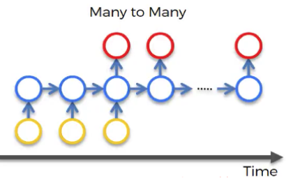
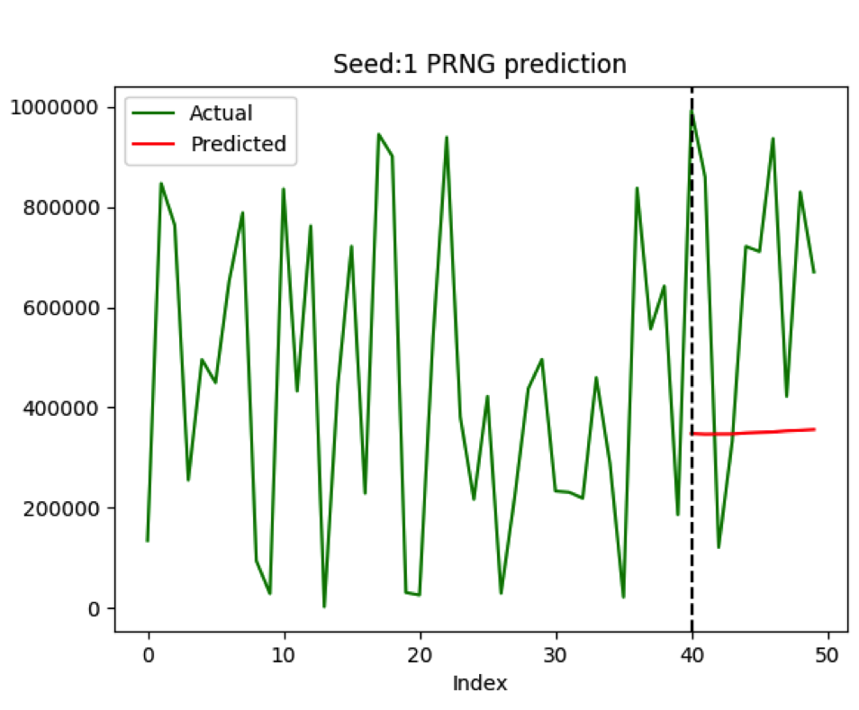
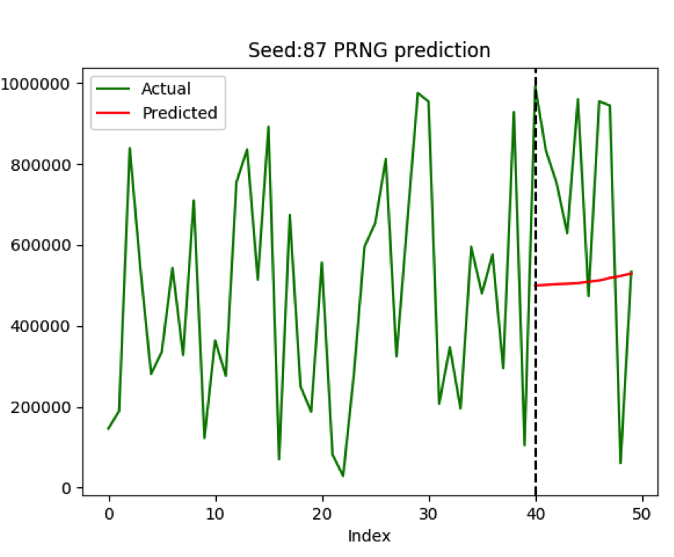
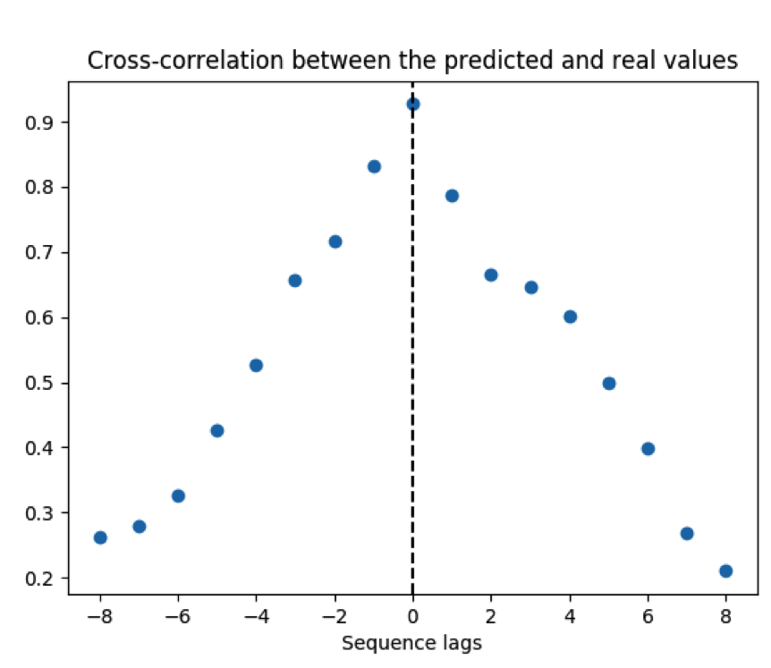
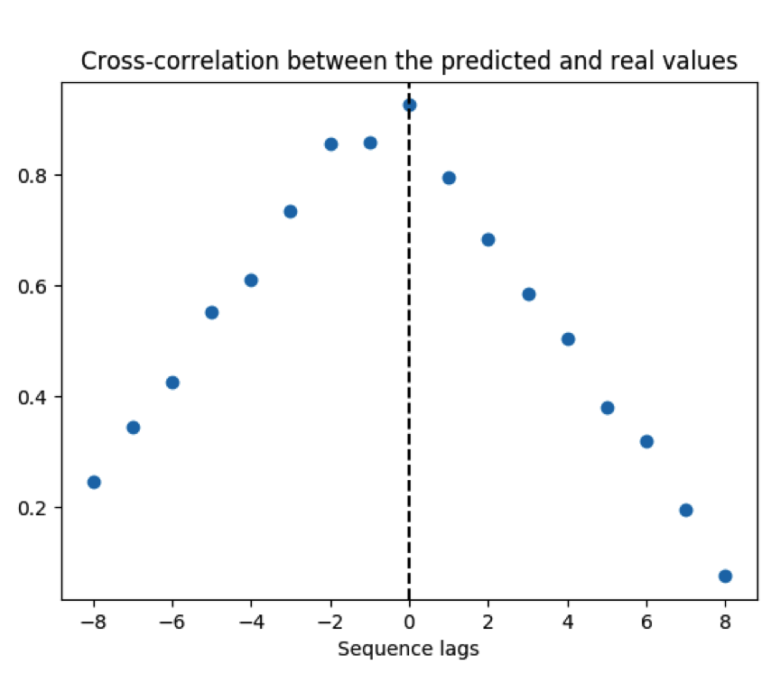
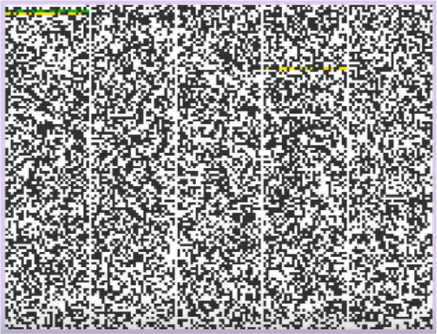

# Playing with Sequential Pattern Recognition on PRNGs

## The Challenge 
* A PseudoRandom Number Generator (PRNG) produces integer sequences whose properties approximate truly random number generators.
* For a given seeded PRNG sequence, train a model to predict the sequence given a sample of its initially generated values. 
* This is a regression problem, as we want to predict a continuous valued outcome.
* Assumptions: 
    * We do not have access to the PRNG algorithm (i.e. we are not revers engineering it).
    * Training & test pool sizes are limited (as per the Case Study’s sample code & CSV file) to:
        * 40 sequential training points
        * 10 sequential test points 
        * 22 sequences, generated from specified (seemingly random) seed values

## Background
* Tools: Python and Keras; a neural network API, which can interface nicely with computationally intensive tools like TensorFlow, Scikit-Learn, Pandas, Matplotlib etc. 
* PRNG: We used the Python built-in random package’s randint method with specified seeds.
* This PRNG uses the Mersenne Twister algorithm which produces 53-bit precision floats and has a period of 219937-1. The Mersenne Twister is one of the most extensively tested random number generators in existence, but is completely deterministic. 

## Primary Solution
* Long Short-Term Memory (LSTMs) Networks: Uses short-term information to predict the next value using recurrent neural networks.
* Design Decisions: 
    * Basically, adding more neurons in LSTM layers equates to  improved handling of complexity.
    * Used an RNN with 4 LSTM layers.
    * Used 50 neurons in each of the 4 LSTM layers.
    

## Results

RMSE: 401421

RMSE: 355693
Avg. RMSE for all seeds: 322437 

## Analysis

* In some cases LSTM’s exhibit autocorrelation, essentially applying a phase shift to the signal. These plots have linear decays, therefore showing no indication of this. However, the strong use of the 0th lag suggests the LSTM is not performing correctly.

## Conclusions
* Cross-correlation indicated that the LSTM identified a mean-trend of the PRNG test data, thus no complex patter recognition was found.
* The Root Mean Squared Error (RMSE) is huge (~1/3 of the possible range), again indicating no patterns are being found. However, RSME and other metrics (like R2 score) could be considered uninformative. 
    * This is again because, LSTM’s can exhibit autocorrelation. 
    * But more importantly, it is because PRNG’s are designed to make it impossible to use historical data to learn behavior and predict future outcomes. It is very tempting to find a pattern when in fact there is none, so any performance metric is potentially misleading (if not carefully examined). 
 * The analysis suggests that an LSTM is not suited to precise PRNG sequence estimations.

## LSTM improvements
* Use more data.
* Use Gaussian Optimization techniques to try to efficiently tune hyper-parameters.
* Increase time steps (I used between 20-30 previous events to predict the next).
* Consider other indicators, like the seed value.
* Increasing network depth to improve handling of complexity.
* But be aware of : 
    * Vanishing gradient problems.
    * The reasoning behind predicting near-perfectly random events.

## Other Solutions
* Seasonal decomposition OR Fourier transforms: Could identify cyclical patters and help us to find potential relationships in the ‘noise’.
* Markov Models (MM): By assigning ranges of values to be states in a MM, you could train it to identify likelihoods of transitions between states. Such systems would go for accuracy of state transition as opposed to precision in value estimation. 
* Convolutional Neural Network (CNN): could leverage visual representations of the test data (as a binary array image like that shown on the top right, or as  random walk images), and use it to find relationships to the next value. 

## References
* References:
    * LSTM diagram: https://www.superdatascience.com/the-ultimate-guide-to-recurrent-neural-networks-rnn/ 
    * Binary array image: https://www.youtube.com/watch?v=_tN2ev3hO14
* Something Extra:
    * Mersenne Twister is very close to being random, however, being completely deterministic, it is not suitable for all purposes, and is completely unsuitable for cryptographic purposes.
